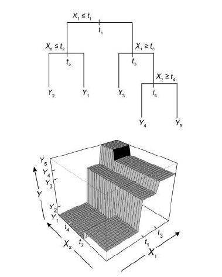

```{r knitr_options, eval=TRUE, echo=FALSE, warning=FALSE, message=FALSE}
# set up knitr options
knitr::opts_chunk$set(message = FALSE,
               warning = FALSE,
               fig.align = 'center',
               dev = c('png'),
               cache = TRUE)
```

```{r Library, eval=TRUE, echo=FALSE, message=FALSE, warning=FALSE}
library(zoon)
library(gridExtra)
```

<hr>

## Introduction

With the abundance of species distribution modelling (SDM) algorithms to pick from, one might find themselves asking which alogorithm to choose? Broadly, algorithms for species distribution modelling fall into three broad categories: 'profile', 'regression', or 'machine learning'. Even within these cateories, there is significant difference in how the algorithm works and the results it provides. And then there's ensemble models which combine  analyses from multiple different alogrithms into a single result. So, which model should we choose to analyse your dataset? The truth is, the algorithm/s we choose depends on the type of data we want to analyse and the question we want to ask.

In this best practice guide we go into detail about some common model algorithms currently available in `zoon`. For each model we will cover which data types it is compatible with, explain the underlying statistical approach, and demonstrate how to fit the model in `zoon`.

Throughout this tutorial we will fit several example SDMs to highlight each model agorithms. To keep comparisons straight forward, we will fit them all to the same Carolina Wren dataset (from online repositories), standardise our covariates, and generate 1000 points of background data. 'zoon' does not yet have any profile methods and so we will confine our discussion to regression and machine learning-based methods.

A brief note on terminology: a species distribution 'model' is the combination of the response data we use (e.g., presence-background), the covariates we include (e.g., mean annual temperature), and the algorithm we use (e.g., logistic regression). When we combine these three things we 'fit' the model. This best practice guide is concerned only with the latter: the algorithm.

<hr>

## Models

### Regression-based Models

Regression analyses estimate the statistical relationship between a dependent variable (e.g., presence of a species) and one or more independent variables (e.g., environmental covariates). The two regression-based SDMs included in 'zoon' and covered here are logistic regression and generalised additive models.

#### Logistic Regression

Logistic regression is a type of Generalised Linear Model (GLM). Where a (non-generalised) linear model estimates a linear relationship between a covariate and a 'continuous' response variable (e.g. y= mx + c), a generalised linear model makes it possible to estimate a linear relatinoship between some covaraites and a resonse varibale that is *not* continuous.

Logistic regression uses the logit link function to estimate the probability of a binary response variable (presence represented as "1" and absence as "0") based on its relationship with one or more independent predictor covariates (see equation XX below). In the same way as we estimate the gradient of a linear relationship (e.g., y = mx +c), logistic regression estimates one regression coefficient (b) for each covariate using maximum likelihood estimation. And let's not forget the intercept.

$$p_i = Pr(Occurrence)\\
logit(p_i) = Intercept + b_1*Covariate1 + b_2*Covariate2 + b_3*Covariate3\\$$ {#eq:Logistic}

The right hand side of this equation is known as the linear predictor.

In `zoon`, we can fit a `LogisticRegression` model by choosing it as the model module in our `zoon` `workflow`. `LogisticRegression` uses the `glm` package.

```{r Logistic_Regression, eval=TRUE, message=FALSE, warning=FALSE, fig.align='center', fig.height=4, fig.width=7}
Logistic_Regression_workflow <- workflow(occurrence = SpOcc("Thryothorus ludovicianus", 
                                                   extent = c(-138.71, -52.58, 18.15, 54.95)),
                                         covariate = Bioclim(extent = c(-138.71, -52.58, 18.15, 54.95)),
                                         process = Chain(StandardiseCov, Background(1000)),
                                         model = LogisticRegression,
                                         output = PrintMap(points = FALSE))
```

#### Generalised Additive Model

Generalised Additive Models (GAMs) are similar to logistic regression but a bit more flexible. Like logistic regression, GAMs can fit presence-background or presence-absence datasets, but they can also fit abudance datasets. The main difference, though, is that unlike logistic regression, GAMs do not estimate regression coeffcients. Instead the linear predictor is the sum of a set of 'smoothing functions' (see equantion XX below). Smoothing functions are... By using smoothing functions instead of regression coefficients, we can fit complex, non-linear relationships between our dependent and independent covariates.

If we use smoothing functions without any restrictions, however, the maximum likelihood estimation of the model will result in a linear predictor that is too complex; one that is 'overfit'. To avoid this, GAMs use 'penalised likelihood maximisation', which penalises the model for each additional smoothing function, thus penalising 'wiggliness'.

$$p_i = Pr(Occurrence)\\
logit(p_i) = Intercept + f_1(Covariate1) + f_2(Covariate2) + f_(Covariate3)\\$$

In `zoon`, the `mgcv` model module fits a GAM using the `mgcv` package. To fit a GAM we need to define a couple of parameters that determine how wiggly and complex we will allow the linear predictor to be. Specifically, we need to define the degrees of freedom, *k*, and select a penalised smoothing basis, *bs*. You can find more details on selecting these parameters using `?mgcv::choose.k` and `?mgcv::smooth.terms`. 

Let's just start by fitting a GAM using the default settings in our `workflow`.

```{r GAM, eval=TRUE, message=FALSE, warning=FALSE, fig.align='center', fig.height=4, fig.width=7}
GAM_workflow <- workflow(occurrence = SpOcc("Thryothorus ludovicianus", 
                                                   extent = c(-138.71, -52.58, 18.15, 54.95)),
                         covariate = Bioclim(extent = c(-138.71, -52.58, 18.15, 54.95)),
                         process = Chain(StandardiseCov, Background(1000)),
                         model = mgcv(k = -1, bs = "tp"),
                         output = PrintMap(points = FALSE))
```

### Machine Learning Models

Machine learning is a field of computer science where algorithms learn from and make predictions on data. 

#### MaxEnt

MaxEnt is one of the most widely used SDM algorithms [(Elith *et al*, 2008)](http://onlinelibrary.wiley.com/doi/10.1111/j.1472-4642.2010.00725.x/abstract). Maxent is used only for presence-background data. Unlike the regression-based analyses discussed above, Maxent does not use maxmimum likelihood estimation. Instead, Maxent uses maximum entropy estimation. Maximum entropy estimation compares the probability density of covariates across the landscape at a random selection of backgorund points, *f(z)*, with the probability density of covariates across the landscape where the species is present, *f1(z)*, where *z* is the environmental covariates. The estimated ratio of *f1(z)*/*f(z)* provides insight on which covariates are important and establishes the relative suitability of one site over another. MaxEnt estimates *f1(z)* such that it is consistent with the occurrence data, but there are many possible distributions so it chooses the one closest to *f(z)*. Minimising this difference is sensible as without absence data we have no information to there is no reason to expect a species to prefer a particular environmental condition over another. The difference, or distance, from *f(z)* is the relative entropy of *f1(z)* with respect to *f(z)*. Minimising the relative entropy is equivalent to maximising the entropy (hence, MaxEnt) of the ratio *f1(z)*/*f(z)*. This model can be described as maximising entropy in geographic space, or minimising entropy in environmental space.

During the model fitting procedure MaxEnt needs to estimate coefficient values such that they meet the above constraints, yet not fit them too closely and result in an overfitted model that has limited generalisability. This is achieved using regularisation, which can be thought of as shrinking the coefficients towards zero by penalising them to balance model fit and complexity. Thus, MaxEnt can be seen as fitting a penalised maximum likelihood model.

This method works with presence-background data. The `MaxEnt` module uses the `maxent()` function in the `dismo` package, and requires a MaxEnt executable file saved in the correct location. The `zoon` helper function `GetMaxEnt()` is available to help with this installation. You select this model in your `workflow` as follows:

```{r MaxEnt, eval=TRUE, message=FALSE, warning=FALSE, fig.align='center', fig.height=4, fig.width=7}
MaxEnt_workflow <- workflow(occurrence = SpOcc("Thryothorus ludovicianus", 
                                                   extent = c(-138.71, -52.58, 18.15, 54.95)),
                            covariate = Bioclim(extent = c(-138.71, -52.58, 18.15, 54.95)),
                            process = Chain(StandardiseCov, Background(1000)),
                            model = MaxEnt,
                            output = PrintMap(points = FALSE))
```

#### Boosted Regression Trees

Boosted regression trees (BRTs) are a machine learning technique that produces a prediction model in the form of an ensemble of weak prediction models (i.e. decision trees). BRTs are known by various names (including Gradient Boosting Machine or GBM), but this is the name most commonly used when referring to SDMs. This differs from the standard regression approach of fitting a single best model (using some information criterion) by using the "boosting" technique to combine relatively large numbers of simple trees adaptively, optimising predictive performance. 

Tree-based models partition the predictor space into rectangles by using a set of rules to identify regions with the most homogenous responses to predictors (see below). A constant value is then fit to each region (most probable class for classification models, mean response for regression models). Growing a tree involves recursive binary splits, such that binary splits are applied to its own outputs until some set criterion is met (such as tree depth).

```{r Decision_Tree_Image, echo = FALSE, fig.cap="*Figure 1. A single decision tree (upper panel), with a response Y, two predictor variables, X1 and X2 and split points t1 , t2 , etc. The bottom panel shows its prediction surface (after Hastie et al. 2001). Image sourced from Elith *et al*, 2008*", fig.align = "centre"}

```

The "boosting" technique is an iterative procedure that attempts to reduce the deviance of the model by fitting another tree to account for the residuals of the previous tree. The core idea is that is it easier to build and average multiple rules of thumb than to find a single, highly accurate prediction rule. There are different boosting algorithms that differ in how they quantify lack of fit, but they all use a forward, stage-wise procedure to gradually increase emphasis on observations modelled poorly by existing trees.

The `GBM` module fits a generalised boosted regression model using the `gbm` package, and it can be fit to presence-background and presence-absence datasets. There are several tuning parameters that you need to set to "tune" the model.

+  Maximum number of trees: This is the equivalent to setting the number of iterations in the model. As a rule of thumb, more is better, but this just sets an upper limit and the optimal number will be selected by cross-validation.

+  The maximum depth of variable interactions: This sets the number of nodes (or splits) in the decision trees. Interactions between variables is automatically modelled in BRTs due to the hierarchical structure of trees such that the response to an input variable is dependant on those higher up the tree. 

+  The learning rate/shrinkage factor: This is the contribution of each tree to the final model average. The sum of fitted values in all trees is multiplied by the learning rate to produce the fitted values in the final model.

This model can be fit using the following call in your `workflow`:

```{r BRT, eval=TRUE, message=FALSE, warning=FALSE, fig.align='center', fig.height=4, fig.width=7}
BRT_workflow <- workflow(occurrence = SpOcc("Thryothorus ludovicianus", 
                                                   extent = c(-138.71, -52.58, 18.15, 54.95)),
                         covariate = Bioclim(extent = c(-138.71, -52.58, 18.15, 54.95)),
                         process = Chain(StandardiseCov, Background(1000)),
                         model = GBM(max.trees = 1000,
                                     interaction.depth = 5,
                                     shrinkage = 0.001),
                         output = PrintMap(points = FALSE))
```

The `XGBoost` software for fitting BRTs is increasingly used in machine learning applications to really big datasets. You can use the `MachineLearn` module to fit BRT models with XGBoost by replacing the model module above with: `MachineLearn(method = 'xgbTree')`

#### RandomForest

Similar to the BRTs in the `GBM` module, random forests are a machine learning technique that make use of an ensemble of weak prediction models (i.e. decision trees). Where BRTs build each subsequent tree in order to explain the most poorly modelled observations of previous trees, each tree in a random forest model is fit independently of each other to a boot-strapped sample of the data. The final predicted output is the mean prediction of all of the trees, which corrects for the tendency of decision trees to over-fit their data.

The `RandomForest` module can be fit to presence-background or presence-absence data using the following call in your `workflow`:

```{r RandomForest, eval=TRUE, message=FALSE, warning=FALSE, fig.align='center', fig.height=4, fig.width=7}
RandomForest_workflow <- workflow(occurrence = SpOcc("Thryothorus ludovicianus", 
                                                   extent = c(-138.71, -52.58, 18.15, 54.95)),
                                  covariate = Bioclim(extent = c(-138.71, -52.58, 18.15, 54.95)),
                                  process = Chain(StandardiseCov, Background(1000)),
                                  model = RandomForest,
                                  output = PrintMap(points = FALSE))
```

<hr>

## Comparing the Models

The most common SDM algorithms have been highlighted above, but how do they compare? First, lets plot their outputs next to each other.

```{r Colour_Palette, eval=TRUE, echo=FALSE, message=FALSE, warning=FALSE}
cls <- colorRampPalette(c('#e0f3db', '#a8ddb5', '#4eb3d3', '#08589e'))(10)  # PrintMap colour palette
```

```{r Comparison, eval=TRUE, message=FALSE, warning=FALSE, fig.align='center', fig.height=10, fig.width=7}
grid.arrange(spplot(Output(Logistic_Regression_workflow), col.regions=cls, cuts = length(cls)-1, main = "Logistic Regression"),
             spplot(Output(GAM_workflow), col.regions=cls, cuts = length(cls)-1, main = "Generalised Additive Model"),
             spplot(Output(MaxEnt_workflow), col.regions=cls, cuts = length(cls)-1, main = "MaxEnt"),
             spplot(Output(BRT_workflow), col.regions=cls, cuts = length(cls)-1, main = "Boosted Regression Tree"),
             spplot(Output(RandomForest_workflow), col.regions=cls, cuts = length(cls)-1, main = "Random Forest"))
```

At first glance there are some big differences in the predicted occurrence maps of the Carolina Wren between SDM algorithms. The regression methods have smoother transitions in the probability of occurrence than the machine learning ones. The Logistic Regression, MaxEnt and Boosted Regression Tree models predict large amounts of area with high probability of occurrence outside of the range of the observed presences, yet the Generalised Additive Model and Random Forest model are mostly restrained to the range of the observed data. Some models predict occurrence probabilities only as high as 0.7, yet others predic values as high as 1.0. So what drives these differences when the models are fit to the same data?

To be continued...
