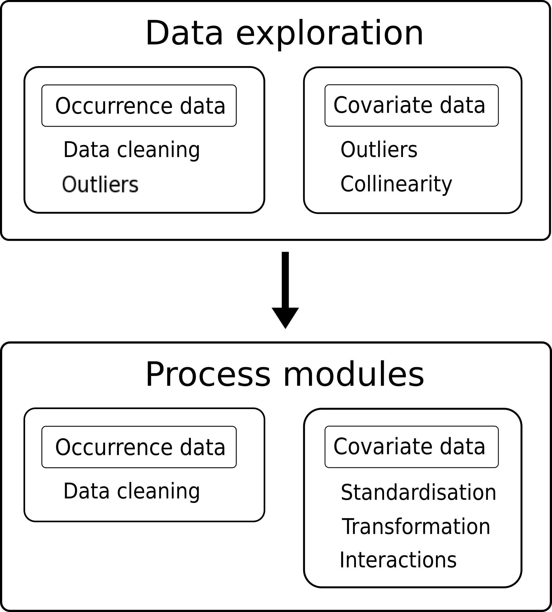

```{r eval=TRUE, echo=FALSE, warning=FALSE, message=FALSE}
# set up knitr options
knitr::opts_chunk$set(message = FALSE,
               warning = FALSE,
               fig.align = 'center',
               dev = c('png'),
               cache = TRUE, 
               comment = '')
```

<hr>

## Introduction

When we undertake a species distribution model (SDM) we use both species occurrence data collected from field surveys or collated observations, as well as environmental predictor data. Before using covariate data to model species occurrence over geographic or environmental space, a crucial first step is to familiarise ourselves with the data and its limitations. It is important to do this before modelling the data, as data exploration can result in consequences for our choice of modelling method as well as the accurracy of the inferences we can make. Equally, choice of model *a priori* may bring a unique set of assumptions that we need to check for in our data. This guide outlines a few suggested steps implemented in both `base` `R` as well as using `zoon`'s `output` and `process` modules for data exploration (Figure 1), but is by no means exhaustive.

```{r echo = F, out.width= '400px', fig.align = "center", fig.cap="*Figure 1. Data exploration considerations for occurence and covariate data*"}

```

<hr>

## Data summary

To begin familiarising ourselves with our data, it is very useful to examine summary information including minimum, maximum, and mean values for each of our covariates. Covariate data is potentially subject to errors, and this is a simple method to check for them. For example, maybe the maximum value in your elevation variable is 1000 m, but you know that the highest peak in your study region is only 500 m. Or maybe your vegetation classification shows ten levels despite it being an eight-category scale.

It can also help us check the format of the covariates - to ensure continuous variables are stored as numeric data and categorical variables as factors. Categorical variables may be erroneously listed in a numerical index (e.g. vegetation categories identified as 1-10), causing them to be mis-classed. Similarly, if there are any typos in numerical data entries that introduce characters (e.g. '2 cm' instead of '2'), then a continuous variable could be classed as a factor. Without addressing these issue our SDM either cannot run or will return erroneous results.

`NA` values are to be expected in our raster data as they are commonly masked to cover only a particular region, however, finding `NA` values for covariates in the training data could indicate that some data points have incorrect latitude/longitude values. This can result from being mapped to locations outide the extent of our study, or suggest that the data point sits on the border of the study region and misses the raster due to its resolution and should be adjusted slightly.

With the `zoon` output module `DataSummary` examining covariate data for these potential pitfalls is very easy. 

```{r packages, message = FALSE, warning = FALSE}
library(zoon)
```

```{r data summary workflow, message = FALSE, warning = FALSE}
Carolina_Wren_Workflow <- workflow(occurrence = CarolinaWrenPO,
                                   covariate = CarolinaWrenRasters,
                                   process = Background(1000),
                                   model = NullModel,
                                   output = DataSummary)
```

Here we can notice several points of interest in our dataset:

+ The covariate `pcCon` possibly displays sampling bias as the range of observed values in our point data (-0.4118, 3.5748) does not over the full range of our values found in our raster data (-0.41, 5.67). This should be explored further to determine if it needs to be accounted for.
+ The `Lat` and `Lon` covariates also suggest a sampling bias that needs to be accounted for. Ordinarily we would not suggest using latitude and longitude as predictor variables but this is just a test dataset. This bias is due to the species observations all occurring in eastern USA.
+ All of our covariates are in the correct format!

<hr>

## Outliers/data cleaning

Species distribution datasets are, to varying degrees, reliant on observation records gathered by humans and therefore subject to human error. Even in situations where we are fitting a model to entirely remotely-sensed data such as bioclimatic variables, our species occurrence records are usually pen-and-paper recordings from the field. This manual data entry can lead to mistakes. One way to check for nonsense entries is to the plot occurrence data to covariates one by one, allowing us to isolate unusual entries. For example, if we plotted against latitude, we might see a single occurrence value at a latitude outside the range of our study. 

You can visualise these plots using the `CovHistogram` output module. 

```{r relationships workflow, message = FALSE, warning = FALSE}
Carolina_Wren_Workflow <- workflow(occurrence = CarolinaWrenPO,
                                   covariate = CarolinaWrenRasters,
                                   process = Background(1000),
                                   model = NullModel,
                                   output = CovHistograms)
```

The `Clean` module removes impossible, incomplete, or unlikely species occurrence records. Impossible occurrence points include those where the location doesn't exist, incomplete records may be missing either a longitude or latitude value (or both), and unlikely data points are those that fall well outside the geographic range of your study area (for example, in the middle of the sea). Within `Clean` these options are referred to by number as impossible (1), incomplete (2), and unlikely (3), and this module is used as follows:

```{r clean workflow, eval = FALSE}
Carolina_Wren_Workflow <- workflow(occurrence = CarolinaWrenPO,
                                   covariate = CarolinaWrenRasters,
                                   process = Chain(Background(1000),
                                                   Clean(which = c(1,2,3))),
                                   model = NullModel,
                                   output = NoOutput)
```

```
The Clean module has removed 0 data points. This includes 0 presences, 0 absences, and 0 background points.
```

Here you can see that our test dataset had no observations that warranted cleaning!

<hr>

## Collinearity

Collinearity is the existence of correlations among covariates, for example between altitude and temperature. For some modelling methods, though notably not all of them, when two covariates in a model are correlated, the modelling method may struggle to identify the impact of each variable independently and the significance of either may be masked. If covariate A and covariate B are correlated, one approach would be to include a single one in the model, preferably based on sound biological justification. Should variable A be included, then in the discussion of the results it will be important to note that the observed effect could equally be driven by correlated covariate B. 

You can check for collinearity in many ways, but the simplest is to look at a pair plot of your covariate data. You can do this using the `zoon` output module `PairPlot`. The upper panel shows a density scatterplots of relationships between covariates, the diagonal panel shows a density of the points as well as variable names, and the lower panel shows the $r^2$ correlation values where darker colours indicate stronger correlation (blue in the positive direction, red in the negative). As a rule of thumb, dropping covariates should be considered when correlation is > 0.7.

```{r pairplot workflow, message = FALSE, warning = FALSE}
Carolina_Wren_Workflow <- workflow(occurrence = CarolinaWrenPO,
                                   covariate = CarolinaWrenRasters,
                                   process = Background(1000),
                                   model = NullModel,
                                   output = PairPlot)
```

Here you can see that there is no apparrent colinearity between any of our covariates.

<hr>

## Covariate Report

A tidy summary of many of these data exploration methods is provided with the `GenerateCovariateReport` `Output` module. This is based on the `GenerateReport()` function in the `DataExplorer` `R` package, but tailored specifically for SDM analyses. These reports show our data structure, the percentage of missing data, the distribution of our covariates (histograms for continuous data, bar charts for discrete), and show the results of a basic correlation analysis. We need to tell the module which report(s) to generate by setting the `type` argument to one of "D" (Data Report only), "R" (Raster report only), or "DR" (Data and Raster Report).

```{r DataReport, eval=FALSE}
Carolina_Wren_Workflow <- workflow(occurrence = CarolinaWrenPO,
                                   covariate = CarolinaWrenRasters,
                                   process = Background(1000),
                                   model = NullModel,
                                   output = GenerateCovariateReport(type = "DR"))
```

<hr>

## Accessor functions

Instead of using modules, we can also manipulate our data directly by using the accessor function `Process()` to generate a dataframe object with extracted raster covariate values for each occurrence point. We can examine the first six rows of this data frame by using the base `R` function `head()`.

```{r}
occ.cov.df <- Process(Carolina_Wren_Workflow)$df

head(occ.cov.df)
```

We can check the format of the data with the `str()` function, or check individual variables with `class()`. 

```{r}
str(occ.cov.df)
```
```{r}
class(occ.cov.df$pcMix)
```

Using base `R` instead of modules echoes the results of the modules we showed off previously!

<hr>

## Conclusion

Data exploration is a crucial first step when performing a species distribution model analysis, but we are not yet ready to jump straight into fitting a model. Next we need to use the information we've gained from our exploration to select our covariates and prepare them for analysis. We explore this topic in the [Selecting and Preparing Covariates](https://rawgit.com/zoonproject/zoontutorials/master/docs/articles/Selecting_Covariates.html) guide.

<hr>
