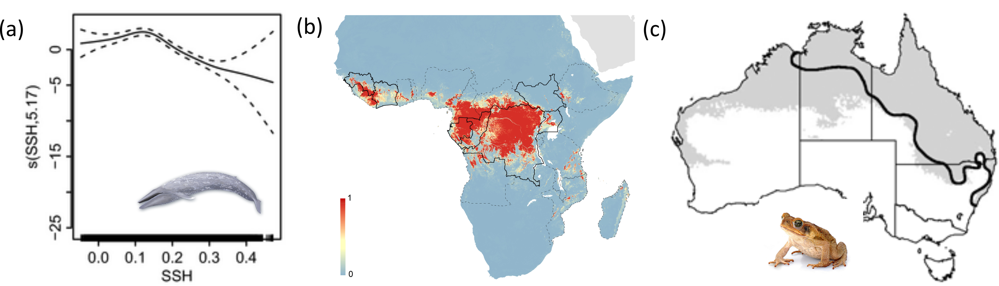

```{r eval=TRUE, echo=FALSE, warning=FALSE, message=FALSE}
# set up knitr options
knitr::opts_chunk$set(message = FALSE,
               warning = FALSE,
               fig.align = 'center',
               dev = c('png'),
               cache = TRUE)
```

## Why do we fit Species Distribution Models (SDMs)?

In ecology, we often want to understand where species are distributed in the environment and why. There are three predominant aims ecologists may have when undertaking a SDM: ecological inference, predicting current extent, and predicting future distribution. 

SDMs predict species occurrence using environmental covariates, and while these relationships are correlative rather than mechanistic, they can still inform underlying ecological relationships. Environmental response curves, for example, can help us visualise how individual environmental parameters relate to probability of occurrence. It is up to the ecologist to interpret these results in a meaningful way, including to assess whether the pattern is rather an indicator that there is a more relevant variable that has not been included in the model. In Figure 1a, we see an example of ecological inference from an SDM of blue whale occurrence. This plot examines how sea surface height (SSH) predicts abundance of the blue whale *Balaenoptera musculus* in both California and Eastern tropical Pacific populations [@redfern17].

SDMs can also be used to visualise or map the extent of species' occurrence in geographic space both in current conditions and into the future, taking into account environmental changes such as climate change. Mapping current distribution can be useful for managers seeking to understand the extent of species' occurrence, for example, for planning responses to public health emergencies or conserving habitat. Species occurrence records are single points in space, so mapping allows us to extend our understanding by predicting the wider habitat from these points. In Figure 1b, we see an example from an SDM of the Ebola virus. This map illustrated the occurrence of the virus at that time [@pigott14]. 

As our understanding and predictive capacity of climate change improves, we are increasingly able to predict future occurrence of species using these new climate scenarios as environmental variables. In Figure 1c, we see an example of this future distribution predictive modeling of the invasive cane toad, *Bufo marinus*, in Australia [@elith10]. The black line delineates the current distribution, and the grey area represent prediction of future occurrence. 

```{r echo = F, out.width= '650px', fig.align = "center", fig.cap="*Figure 1. Species Distribution Modelling aims: ecological inference (a; figure from (@redfern17), photo from (@cetus)), predicting current species' distributions (b; figure from (@pigott14)), or mapping future distributions (c; figure from (@elith10), photo from (@fraser-smith)).*"}

```


## What is a species distribution model?
Where we find species in geographic species is typically considered the result of three main factors: the abiotic environment, the biotic environment, and the species' movement capabillity [@soberon05]. Together, these three factors determine the species' *ecological niche*. The intersection of the abiotic and biotic environmental conditions constitutes the *fundamental niche*, or where the species could physiologically occur given what we know of its biology and ecology. However, experience tells us that species are not always located where we expect them to be. Their *realised niche* is where they actually exist within the bounds of the environmental space where they could potentially exist. For example, a species may be constrained by the climate required for individuals to survive, the local vegetation types it depends on, or its abillity to traverse different landscapes. 

Species distribution models estimate a species' realised niche. They do this by estimating the probabilty of occurrence of species along environmental gradients using correlation between environmental covariates and species occurrence data. Using SDMs, we can estimate the probability a species of bird will use forest habitat with high tree cover compared to open habitat with low tree cover. We can then take these statisical relationships and project them onto geographic space, which allows us to visualise how the probability of species occurrence varies in space.

We have visualised this theory in Figure 2 below. This dataset uses presence data of the Carolina Wren as well as a suite of environmental predictors such as cover of different forest types. In the top left corner we have mapped onto geographic space the records of species occurrence (black dots) as well as the background points we will use in our model. In the top right we see these same points plotted in environmental space against two covariates. We can see that the presence points are clustered at higher percents of deciduous forest and lower percents of mixed forest. The model uses this presence background data to construct predictions of species occurrence in environmental space, as seen in the bottom right plot. In the final plot, bottom left, we see these probability predictions mapped back onto geographic space in a way that allows us to understand where and by what drivers the species is likely to occur. There are many types of species distribution models and the field is rapidly expanding. *expand...many different way and decision to be made along the way*

```{r echo = F, out.width= '650px', fig.align = "center", fig.cap="*Figure 2. Species Distribution Model Theory. Presence-background points plotted on geographic space and on environmental space (top panel; P = presence, B = background), and probability of occurrence predictions plotted on environmental and geographic space (bottom panel; colour scale represents probability of occurrence).*"}
knitr::include_graphics("../vignettes/Images/Figure_2_SDMtheory.png")
```

## How do I fit a species distribution model with `zoon`?
`zoon` is concerned with correlative SDMs, as described above, which are the most widely used SDM. This tutorial will focus on distribution models that estimate probability of occurrence, however, we could also use species abundance data to estimate how abundance varies along environemntal gradients.

We implement a species distribution model with five steps: *make more zoon perspective*

1.  Occurence: We first gather and format our species occurrence data.
2.  Covariates: Next, we gather and format the environmental covariates we believe are important to our species of interest.
3.  Process: Often our data, both occurrence and environmental, will need some pre-processing before we fit our models.
4.  Model: We then fit one or more statistical models to our data to estimate species probability of occurrence.
5.  Output: Finally, after fitting our model, we produce model outputs, such as graphs and maps, to enable us to make ecological inference about the species.

The `zoon` workflow is structured around these five steps and designed to make building and fitting SDMs straight-foward and reproducible. The primary zoon function is `workflow()`, which we use to fit the SDM. The workflow function has five arguments, one for each step in the SDM fitting process. For each argument, we need only to select a module. The modules we choose in each step determine what type of model we run with what data and what outputs we produce.

This tutorial will guide you through the process of selecting a module for each argument of the `workflow()` function. Along the way, we'll introduce some key factors that you should consider when fitting and evaluating an SDM.

But first, let's fit a quick and simple SDM with `zoon` as a means of introduction. Don't forget to load the package!

```{r message=FALSE, warning=FALSE, cache=TRUE}
library(zoon)
```

A basic workflow for the Carolina Wren in the contiguous USA could look like this:

```{r message=FALSE, warning=FALSE, fig.align='center', fig.height=7, fig.width=7}
zoon_workflow <- workflow(occurrence = CarolinaWrenPO,
                          covariate = CarolinaWrenRasters,
                          process = Background(100),
                          model = MaxEnt,
                          output = InteractiveMap)
```

```{r echo=FALSE, fig.align='center', fig.height=7, fig.width=7}
# force the htmlwidget to render in the vignette
Output(zoon_workflow)
```

In this workflow, we have obtained occurrence records for the Carolina Wren from a `zoon` module, loaded environmental covariates from another `zoon` module, selected 100 background points (more on this later), fit a MaxEnt model, and generated our results as an interactive map. 

Through this tutorial we will guide you step-by-step through each of the arguments in a workflow as we update this `zoon_workflow`. You might like to explore some different combinations of modules yourself, and you can find more information by running the `GetModuleList()` command. Be sure to explore the other tutorials as well that go through these steps in greater detail.


## The five `zoon` workflow steps *edit*
### Step 1. Occurrence

Species distribution models are fitted with species occurrence data, the most common of which are: presence-only, presence-background, and presence-absence. Less commonly, species distribution models can be fit with abundance data.

* Presence-only data is usually sourced from museum or herbarium records, and is a list of all recorded sightings/captures of a species with its location.

* Presence-background data is a type of presence-only data that combines presence records with randomly generated background points, also called 'pseudo-absences.' This is the more common of the two types.

* Presence-absence data generally comes from structured field surveys where the presence *or* absence of the target species is recorded for a given site.

Presence-only data is widely and freely accesible only and as a result is more commonly used than presence-absence data. As such, we write this tutorial for presence-only data and note any necessary alterations for presence-absence data.

The first module required in a `workflow()` is `occurrence` and it is where we load our species occurrence data. There are three methods for loading data into our workflow depending on where the data is sourced: we can use pre-existing `occurrence` modules in `zoon` like `Lorem_ipsum_UK`, download data from an online repository using `SpOcc`, or load in our own data from a local computer using `LocalOccurrenceData`.

`zoon` has several functions available to view the contents of each module in the workflow. For example, we can view our species occurrence data using the `Occurrence()` accessor function (using base R `head()` function to see only the first six lines):

```{r eval=TRUE, message=FALSE, warning=FALSE, cache=TRUE}
head(Occurrence(zoon_workflow))
```

The first two columns provide the geographic location of the observation (as longitude and latitude), the third column is the observation value (1 = presence, 0 = absence), the fourth column is the type of observation, and the last column identifies the "fold" (folds are covered later in the section of `Process` modules, but a default model can be considered to always have one fold).

### Step 2. Covariates

The second module required in a `workflow` loads environmental data. As with `occurrence` modules, there are many different modules to choose from. There are `zoon` modules that contain data, such as `CarolinaWrenRasters`, and modules that source data from online sources such as `Bioclim`. We can also load our own data from a local computer using `LocalRaster`.

Covariates use the rasterStack data format to store data and the `Covariate()` function extracts the covariates from the workflow.

```{r eval=TRUE, message=FALSE, warning=FALSE, cache=TRUE}
Covariate(zoon_workflow)
```

Using what we've learned here, let's update `zoon_workflow` so that we can build an SDM for the Carolina Wren in the USA using data from online repositories rather than a `zoon` data module. We keep all other aspects of the work the same.

```{r eval=TRUE, message=FALSE, warning=FALSE, fig.align='center', fig.height=4, fig.width=7, cache=TRUE}
zoon_workflow <- ChangeWorkflow(workflow = zoon_workflow,
                                occurrence = SpOcc("Thryothorus ludovicianus",
                                                   extent = c(-138.71, -52.58, 18.15, 54.95)),
                                covariate = Bioclim(extent = c(-138.71, -52.58, 18.15, 54.95)))
```

```{r echo=FALSE, fig.align='center', fig.height=7, fig.width=7}
# force the htmlwidget to render in the vignette
Output(zoon_workflow)
```


### Step 3. Process

Now that we have loaded in our species and environmental data using the `occurrence` and `covariate` modules, the `process` modules will perform any pre-processing of our data required before fitting the model itself. This is where we can modify our raw data by removing poor data points using the `Clean` module or standardising our covariates using `StandardiseCov`, generate the background data points required for presence-only data analysis using `Background`, add interaction terms between our covariates using `addInteractions`, or set up model validation methods using modules like `CrossValidate`.

Let's check out our environmental data by using the function `Covariate()`. This function returns a summary of our raster data. In this case, we have five covariates stored in raster layers which are themselves stored in a raster brick. Our covariates are the Bioclim variables `bio1`, `bio2`, `bio3`, `bio4`, and `bio5`.

```{r eval=TRUE, cache=TRUE}
Covariate(zoon_workflow)   # Before standardisation
```

Since we are using presence-only data in our model we need to generate some background data, also known as pseudo-absences. Depending on the type of model (see next section), this data is used to either sample the range of environmental space in the landscape to compare it to where the species has been found, or as a non-presence class of data. We also want to standardise our covariates, so to use multiple modules in an argument we can use the `Chain()` function. Here we use `StandardiseCov` to standardise our covariates and  `Background` to generate 1000 (increased from 100 in early examples) background points.

```{r eval=TRUE, message=FALSE, warning=FALSE, fig.align='center', fig.height=4, fig.width=7, cache=TRUE}
zoon_workflow <- ChangeWorkflow(workflow = zoon_workflow,
                                process = Chain(StandardiseCov, Background(n = 1000)))
```

```{r echo=FALSE, fig.align='center', fig.height=7, fig.width=7}
# force the htmlwidget to render in the vignette
Output(zoon_workflow)
```

In some instances we may not need a `process` module in our `workflow`, however, it is a mandatory argument and so the `NoProcess` module can be used as a 'blank' module.

### Step 4. Model

A fundamental aspect of the `workflow` is the `model` module. This is where we choose which type of SDM you want to fit to our data. There are multiple different SDM methods to choose from and each have their merits [@elith06]. A few more common examples include the `LogisticRegression`, `mgcv`, `MaxEnt`, `RandomForest`, and `GBM` modules. For more detail on these methods you can refer to the ["Choosing A Model" vignette](Choosing_A_Model.html).

Now, let's update our `workflow` with another common model type, logistic regression. We do this by using the aptly named `LogisticRegression` module.

```{r eval=TRUE, warning=FALSE, message=FALSE, fig.align='center', fig.height=4, fig.width=7, cache=TRUE}
zoon_workflow <- ChangeWorkflow(workflow = zoon_workflow,
                                model = LogisticRegression)

```

```{r echo=FALSE, fig.align='center', fig.height=7, fig.width=7}
# force the htmlwidget to render in the vignette
Output(zoon_workflow)
```

### Step 5. Output
Once we're happy with the included data, the model type we've chosen, and we've included all relevant processes, it is finally time to check our results.

Let's start by mapping our probability of occurrence predictions onto geographic space. We can use the `InteractiveMap` module to create a map showing the predicted species distribution and overlying presence points.

```{r eval=TRUE, message=FALSE, warning=FALSE, fig.align='center', fig.height=7, fig.width=7, cache=TRUE}

zoon_workflow <- ChangeWorkflow(workflow = zoon_workflow,
                                output = InteractiveMap)

```

```{r echo=FALSE, fig.align='center', fig.height=7, fig.width=7}
# force the htmlwidget to render in the vignette
Output(zoon_workflow)
```

The `InteractiveMap` module produces a map of occurrence probability that we can manipulate. The map shows a scale from light green to purple and overlays our raw data on top of the map so we can see how our data align with model predictions. We can click on our raw data to get information about it.

The `InteractiveMap` shows us that, according to the data we included, the Carolina Wren is most likely to occur in the southeast of the United States (higher probability of occurrence: purple) and is less likely to exist in the northwest of the country (lower probability of occurrence: yellow). These quantitative predictions fit with a qualitative analysis of our data; most of our presence records (white dots) are in the southeast of the map.

Now we've seen how Carolina Wren occurrence varies over geographic space, let's look more closely at what is driving that variation. That is, how does probability of occurrence vary along the environmental gradients we included in our model. For this, we can use the `ResponsePlot` module to make graphs of the predicted relationships between probabilty of occurrence and our environmental covariates.


Without input arguments, `ResponsePlot` plots a graph for each covariate included in our model. We can also specify, which covariate we want to plot.
```{r echo=TRUE, eval=FALSE, message=FALSE, warning=FALSE, fig.align='center', fig.height=5, fig.width=7, cache=TRUE}
zoon_workflow <- ChangeWorkflow(zoon_workflow,
                                output = ResponsePlot())
```

```{r echo=FALSE, eval=TRUE, cache = TRUE, message=FALSE, warning=FALSE, fig.align='center', fig.height=5, fig.width=7, cache=TRUE}
par(mfrow=c(2,3))
zoon_workflow <- ChangeWorkflow(zoon_workflow,
                                output = ResponsePlot())
```

## Putting it all together
Now that we have seen how to use each argument in the `workflow()` function it is time to put all of the pieces together and fit our own SDM within `zoon`. As MaxEnt is arguably one of the most popular SDM methodologies, lets fit a MaxEnt model in addition to the logistic regression. This is achieved using the `List()` function. We will fit these models to the Carolina Wren data obtained from GBIF and the Bioclim environmental variables, generate 1000 background samples, and display our results in a map without our raw data displayed. We have covered each of the necesssary modules previously, and here we will run them together to form a complete `workflow()`.

```{r eval=TRUE, message=FALSE, warning=FALSE, fig.align='center', fig.height=4, fig.width=7, cache=TRUE}
Dual_Model_Workflow <- workflow(occurrence = SpOcc("Thryothorus ludovicianus",
                                                   extent = c(-138.71, -52.58, 18.15, 54.95)),
                                covariate = Bioclim(extent = c(-138.71, -52.58, 18.15, 54.95)),
                                process = Background(1000),
                                model = list(LogisticRegression, MaxEnt),
                                output = PrintMap(points = FALSE))
```

There are some obvious differences in the predicted distribution maps of these two models. There are no differences between the inputs or outputs for each model because we used a single workflow. That means each model used the same data, but the predicted distribution of the species is different between the models. What causes the difference? Check out our more detailed guide on SDM algorithm selection here to learn more ["Choosing A Model" vignette](Choosing_A_Model.html)

## Saving our work
Our final analysis is stored in the the zoon workflow object `Dual_Model_Workflow`. This object contains all of the code needed to re-run the analysis, all of the data we used, and all of the results. So if we save this object we can always re-load it to access our results, get different outputs, or try different methods, just by using `ChangeWorkflow()`.

We can save `Dual_Model_Workflow` as a single .RData object with R's `save()` command:

```{r eval = FALSE}
save(Dual_Model_Workflow,
     file = 'Dual_Model_Workflow.RData')
```

and reload it with `load()`
```{r eval = FALSE}
load('Dual_Model_Workflow.RData')
```

Because the workflow object conatains the whole analysis, we can also share it with collaborators: they just need to install `zoon` and load the workflow object and they can access and modify the analysis too. We could also use the `ZoonFigshare()` function to upload the workflow to `figshare.com` and make it available to the public.


## Conclusion
In this tutorial we have used the `zoon` package to successfully run and interpret a species distribution model in a fully reproducible way. We loaded our occurrence and covariate data for our species of interest, pre-processed that data as required, ran our model, and produced some outputs. The interpretation of those outputs has increased our knowledge of the Carolina wren: we've learned the Carolina wren is most likely to occur in the southeast USA. We've also learned that the wren does not particuarly mind the relative cover of forest types, having similar probability of occurrence in each type.

**I feel like we need a zoon conclusion, not really to end on learning about the wren??**
